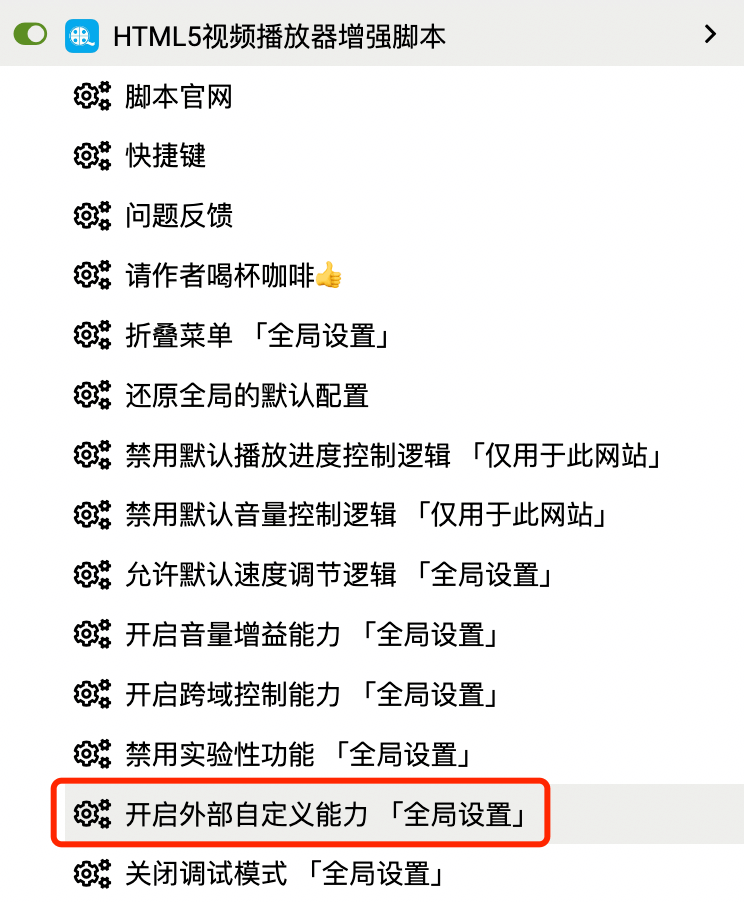

# 功能手册

## 播放倍速调节

倍速调节的基本快捷键如下：  

|  快捷键   | 说明    |
| --- | --- |
| C | 加速播放 +0.1 |
| X | 减速播放 -0.1 |
| Z | 正常速度播放 |

按住键盘的 `C` `X` `Z` 即可实现调速的基本操作，

如果你觉得0.1的调节幅度太慢，还可以通过数字键：`1-4`来快速指定需要的倍速：

|  单击数字键   | 说明    |
| --- | --- |
| 1 | 设定1x的播放速度 |
| 2 | 设定2x的播放速度 |
| 3 | 设定3x的播放速度 |
| 4 | 设定4x的播放速度 |

通过数字键可以快速地进行速度的跳跃，通常来说已经可以满足绝大多数的调速场景了，但是你或许还想快速地设定更高的倍速，用来`跳过片头、片尾、广告`或者进行视频的`高速回看`等  

为了满足上述需求，`3.5.2`以上的版本增加了倍速跳跃式调节的能力，简单来说就是通过快速双击数字键，可以获得当前数字键叠加的速率：

|  双击数字键   | 说明    |
| --- | --- |
| 1 | 设定2x的播放速度 |
| 2 | 设定4x的播放速度 |
| 3 | 设定6x的播放速度 |
| 4 | 设定8x的播放速度 |

如果觉得还不够，还可以通过长按数字键，实现倍速的不断叠加，直至达到浏览器支持的倍速极限：16x

|  长按数字键   | 说明    |
| --- | --- |
| 1 | 加速播放+1，直至16x |
| 2 | 加速播放+2，直至16x |
| 3 | 加速播放+3，直至16x |
| 4 | 加速播放+4，直至16x |

## 播放音量调节

播放音量调节的基本快捷键如下：  

|  快捷键   | 说明    |
| --- | --- |
| ↑ | 音量升高 5% |
| ↓ | 音量降低 5% |

如果希望更大幅度的进行音量调节，可以使用以下快捷键：

|  快捷键   | 说明    |
| --- | --- |
| Ctrl+↑ | 音量升高 20% |
| Ctrl+↓ | 音量降低 20% |

但上面的快捷键容易跟系统中的其它快捷键冲突而无法使用，例如再MacOs下这个快捷键就没法使用  

有些网站会阻止外部逻辑进行音量调节，例如 [知乎视频](https://www.zhihu.com/education/learning)，为此脚本增加了彻底接管音量管理的逻辑，但这个需要自己手动开启，因为一旦开启后，将会出现以下情况：

- 只能使用插件的快捷键进行调节音量
- 网站自身的调音管理操作将失效

开启方式：在你需要开启的视频地址下点击`Tampermonkey`插件图标，将出现下面的选项：  

  

::: tip
更改该配置只会这对当前网站生效，而不会应用到全局，如果还有其它网站也无法进行播放音量的控制，还需在对应的网站下重复上面的设置
:::

## 播放进度调节

播放进度调节的基本快捷键如下：  

|  快捷键   | 说明    |
| --- | --- |
| → | 快进5秒 |
| ← | 后退5秒 |

如果希望更大幅度的进行进度调节，可以使用以下快捷键：  

|  快捷键   | 说明    |
| --- | --- |
| Ctrl+→ | 快进30秒 |
| Ctrl+← | 后退30秒 |

但上面的快捷键容易跟系统中的其它快捷键冲突而无法使用，例如再MacOs下这个快捷键就没法使用  

有些网站会阻止外部逻辑进行进度调节，例如 [腾讯课堂](https://ke.qq.com/)，为此脚本增加了彻底接管播放进度管理的逻辑，但这个需要自己手动开启，因为一旦开启后，将会出现以下情况：

- 只能使用插件的快捷键进行播放进度调节
- 网站自身的播放进度管理操作将失效

  

::: tip
更改该配置只会这对当前网站生效，而不会应用到全局，如果还有其它网站也无法进行播放进度的控制，还需在对应的网站下重复上面的设置
:::

## 全屏与网页全屏

对视频进行全屏与网页全屏快捷键如下：  

|  快捷键   | 说明    |
| --- | --- |
| Enter | 进入/退出全屏 |
| shift+Enter | 进入/退出网页全屏 |
| Esc | 退出全屏/网页全屏 |

::: warning
由于全屏和网页全屏的复杂性，并不能保证这个功能100%正常使用，大多数网站都需要进行针对性地兼容才能保持跟网站自身的全屏/网页全屏逻辑一致，例如：B站、油管等。对于主流视频网站，作者会不定期地对这些网站的功能进行兼容逻辑调整和完善，以优先确保这些网站的功能可用
:::

## 视频截图

进行视频画面截图的快捷键如下：  

|  快捷键   | 说明    |
| --- | --- |
| shift+S | 截图，截取当前画面并保存 |

当你暂停下来发现要截图的画面看起来并不太满意，想找出最好看的一帧画面，这个时候可以使用帧操作快捷键对画面进行微调：

|  快捷键   | 说明    |
| --- | --- |
| D | 上一帧画面 |
| F | 下一帧画面 |

截图成功后，脚本会根据网站的支持情况决定是要将截图画面保存到电脑本地的下载文件夹，还是新开弹窗，让用户自行对截图画面进行操作

::: tip
如果截图后能自动下载保存到本地文件夹，这个时候脚本也会尝试自动将截图写入到你的剪贴板里，从而允许你直接将截图粘贴到聊天窗口或word文档中
:::

::: warning
如果你按了截图快捷键，既没有自动下载，也没新开窗口，这个时候很有可能是你阻止了新开弹窗，导致截图功能异常，只需要设置允许当前网站的弹窗操作即可
:::

## 媒体下载

进行媒体文件下载的快捷键如下：  

|  快捷键   | 说明    |
| --- | --- |
| shift+D | 下载音视频文件（实验性功能） |

::: tip
理论上支持下载所有使用标准H5技术进行播放的媒体文件，但不排除网站自身做了很多反下载的工作，而导致无法正常下载
:::

::: warning
注意：媒体下载目前属于实验性功能，必须手动开启 `开启实验性功能` 选项才会启用该功能，关于如何开启实验性功能可见相关的Q&A说明
:::

## 画中画功能

画中画功能允许你将当前的视频画面以小窗的形式至于其它页面/窗口的顶部，从而实现边看视频，边进行其它操作  

开启视频画中画的快捷键如下：

|  快捷键   | 说明    |
| --- | --- |
| shift+P | 进入或退画中画功能 |

为了在其它网页上也能对画中画的视频进行控制，当进入画中画后，插件将开启跨TAB控制能力  

一些基本的视频控制快捷键，都能正常地应用到画中画的视频中，如：

- 播放/暂停
- 调速/调音
- 播放进度控制

::: tip
跨TAB控制允许你在别的网页通过快捷键(shift+P)退出画中画，并且在退出时保留10s的跨TAB控制能力，这使得你退出后依然可以进行播放/暂停等操作，而无需切换回原网页进行操作
:::

::: warning
开启画中画后，因为要进行跨TAB控制，所以会导致一些默认的快捷键失效，如果你需要对其它网页进行频繁的快捷键操作，建议先关闭画中画，否则容易给你造成不必要的困扰
:::

## 画面平移与缩放

脚本允许你通过快捷键对视频画面进行平移和缩放，其快捷键如下：

|  快捷键   | 说明    |
| --- | --- |
| shift+C | 放大视频画面 +0.05 |
| shift+X | 缩小视频画面 -0.05 |
| shift+Z | 恢复视频画面 |
| shift+→ | 画面向右移动10px |
| shift+← | 画面向左移动10px |
| shift+↑ | 画面向上移动10px |
| shift+↓ | 画面向下移动10px |

`3.5.1`以上的版本增加视频画面平移、缩放的恢复和还原能力，即通过按shift+Z可以恢复到初始化画面状态，再次按shift+Z又可以还原到上一次设置的画面平移，缩放状态

::: tip
视频画面平移与缩放、镜像与旋转以及给视频增加滤镜这些操作，都能通过刷新页面来恢复到正常画面状态，所以不记得快捷键，或不小心误触了键盘，导致视频画面异常了，不必“恐慌”，只需要刷新一下即可恢复过来
:::

## 画面镜像与旋转

脚本允许你通过快捷键对视频画面进行镜像与旋转，其快捷键如下：  

|  快捷键   | 说明    |
| --- | --- |
| S | 画面旋转 90 度 |
| M | 画面水平镜像翻转 |
| shift+M | 画面垂直镜像翻转 |

::: tip
视频画面平移与缩放、镜像与旋转以及给视频增加滤镜这些操作，都能通过刷新页面来恢复到正常画面状态，所以不记得快捷键，或不小心误触了键盘，导致视频画面异常了，不必“恐慌”，只需要刷新一下即可恢复过来
:::

## 滤镜调节

脚本支持对视频画面进行滤镜调节，其快捷键如下：  

|  快捷键   | 说明    |
| --- | --- |
| E | 亮度增加% |
| W | 亮度减少% |
| T | 对比度增加% |
| R | 对比度减少% |
| U | 饱和度增加% |
| Y | 饱和度减少% |
| O | 色相增加 1 度 |
| I | 色相减少 1 度 |
| K | 模糊增加 1 px |
| J | 模糊减少 1 px |
| Q | 图像复位 |

::: tip
视频画面平移与缩放、镜像与旋转以及给视频增加滤镜这些操作，都能通过刷新页面来恢复到正常画面状态，所以不记得快捷键，或不小心误触了键盘，导致视频画面异常了，不必“恐慌”，只需要刷新一下即可恢复过来
:::

## 快捷键触发范围调整

默认情况下，在有视频的网页里，快捷键的触发范围将是这个网页的任意区域，这有利于非常方便地进行视频的控制。  

但由于作用范围过广，难免可能会生产一些意想不到的负面影响，如果出现了这种情况，你可以尝试将快捷键触发范围调整至：只当鼠标焦点处于视频DOM里才触发，其切换的快捷键如下：

|  快捷键   | 说明    |
| --- | --- |
| ctrl+\ | 快捷键是否全网页可用，默认true |

当视频画面的右上角出现：`全局模式：off` 字样时，则意味你的触发焦点调整成功了：

  

## 自定义功能和配置

为了解决键位被大量占用，和快捷键冲突的问题，`v3.7.0` 版本增加了允许外部自定义快捷键和自定义配置等能力。

为了减少可能潜在的外部污染，自定义外部能力需要菜单开启后才能使用：

开启后即可通过外部脚本来定义该插件的快捷键和其它相关的能力  

您可参照下面这份脚本来进行自定义：[https://greasyfork.org/zh-CN/scripts/455396](https://greasyfork.org/zh-CN/scripts/455396)  

您也可以点击下面链接查看完整的自定义参考代码：
[HTML5播放器自定义配置](./customConfiguration.md)

<Vssue :title="$title" />
