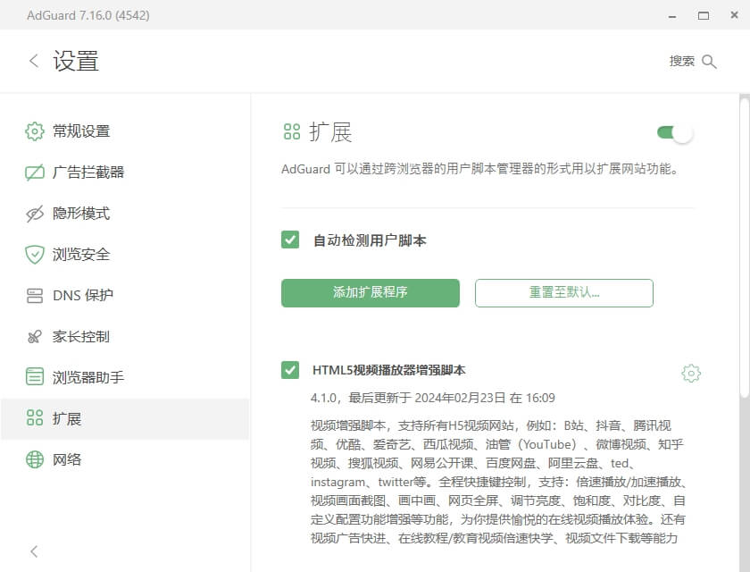

# 安装详解

> 安装脚本前需先安装[油猴插件](https://www.tampermonkey.net)，
> [油猴(Tampermonkey)](https://www.baidu.com/s?wd=%E6%B2%B9%E7%8C%B4%E6%8F%92%E4%BB%B6%E5%AE%89%E8%A3%85)是一款广受好评的、用于加载用户脚本的浏览器插件，支持：Chrome、Edge、Firefox、safari、Opera、以及[国内众品牌的浏览器](https://www.baidu.com/s?wd=%E5%9B%BD%E5%86%85%E6%B5%8F%E8%A7%88%E5%99%A8)

**安装好油猴插件后**，点击下面的链接即可一键安装：  

- **[h5player.user.js (点我直接安装)](https://update.greasyfork.org/scripts/381682/HTML5%E8%A7%86%E9%A2%91%E6%92%AD%E6%94%BE%E5%99%A8%E5%A2%9E%E5%BC%BA%E8%84%9A%E6%9C%AC.user.js)**  

如果你是第一次接触，各种情况下安装油猴(Tampermonkey)的方法如下：

## 正常安装

> 正常安装油猴(Tampermonkey)，只需通过官网或者应用商店安装即可，但国内很多时候下面的链接不一定能打得开，则需要参考下面得国内安装方法。

油猴官网：[https://www.tampermonkey.net](https://www.tampermonkey.net)  
你可以通过官网的说明进行下载安装，或者通过各大浏览器的应用商店安装。

如果你的网络能打开下面应用商店的地址，则直接安装即可：

- [Tampermonkey - Chrome应用商店](https://chrome.google.com/webstore/detail/dhdgffkkebhmkfjojejmpbldmpobfkfo)
- [Tampermonkey - Edge应用商店](https://microsoftedge.microsoft.com/addons/detail/iikmkjmpaadaobahmlepeloendndfphd)
- [Tampermonkey - Firefox应用商店](https://addons.mozilla.org/en-US/firefox/addon/tampermonkey/)
- [Tampermonkey - Safari应用商店](https://apps.apple.com/us/app/tampermonkey/id1482490089)
- [Tampermonkey - Opera应用商店](https://addons.opera.com/en/extensions/details/tampermonkey-beta/)

**安装好油猴(Tampermonkey)插件后**，点击下面的链接即可完成脚本的安装：  

**[h5player.user.js (点我完成H5Player增强脚本的安装)](https://update.greasyfork.org/scripts/381682/HTML5%E8%A7%86%E9%A2%91%E6%92%AD%E6%94%BE%E5%99%A8%E5%A2%9E%E5%BC%BA%E8%84%9A%E6%9C%AC.user.js)**  

直接在浏览器地址栏里输入如下的URL也能完成脚本的安装：

- [https://h5player.anzz.top/h5player.user.js](https://h5player.anzz.top/h5player.user.js)

## 国内安装

> 国内由于网络环境的原因，很多时候并不能通过浏览器的应用商店直接安装，这个时候只能通过离线安装的方式来安装油猴(Tampermonkey)。  

下面是油猴(Tampermonkey)的离线安装包，将离线包下载回来，然后通过浏览器的扩展程序页面进行安装即可。

### 第一步：下载离线包

Tampermonkey离线包的官方地址，可能没法访问，如果不行用下面的网盘地址，如果可以优先使用下面地址：

- [Tampermonkey离线包](https://data.tampermonkey.net/tampermonkey_stable.crx)

国内能访问的网盘文件地址：

- [Tampermonkey.crx - 蓝奏云](https://wwt.lanzouq.com/izahN1p5e0pg) 提取密码：fn2o
- [Tampermonkey.crx - 百度云](https://pan.baidu.com/s/1ErjSyfI4W2mop1b452j1CQ?pwd=ayi3) 提取密码：ayi3

如果你用的是360极速浏览器等国产浏览器，此时只需将下载好的离线包拖拽到浏览器窗口即可完成安装。  

如果不是，或者直接拖拽进去没法安装，那么请继续下面的步骤。  
  
### 第二步：开启开发者模式

你可以通过菜单选项或者地址栏输入`chrome://extensions/`来打开浏览器的扩展程序页面，然后打开开发者模式。


### 第三步：解压离线包并加载安装

下载回来的离线包，本质上是一个tar的压缩包，window下将文件名后缀改为`.tar`，然后通过zip或rar等解压工具就能解压出来，再去扩展程序页面点击`加载已解压的扩展程序`，选择解压出来的文件夹即可完成安装。  

如果是macOS或者linux系统，可以通过命令行解压，然后通过扩展程序页面加载安装。

```bash
# 注意文件名要根据实际情况修改
tar -xvf tampermonkey_stable.crx
```

### 第四步：安装h5player增强脚本

**[h5player.user.js (点我完成H5Player增强脚本的安装)](https://update.greasyfork.org/scripts/381682/HTML5%E8%A7%86%E9%A2%91%E6%92%AD%E6%94%BE%E5%99%A8%E5%A2%9E%E5%BC%BA%E8%84%9A%E6%9C%AC.user.js)**  

直接在浏览器地址栏里输入如下的URL也能完成脚本的安装：

- [https://h5player.anzz.top/h5player.user.js](https://h5player.anzz.top/h5player.user.js)

## 移动端安装

对于有移动端需求的用户，脚本也是可以支持运行的。  

移动端优先推荐使用 [Kiwi Browser](https://kiwibrowser.com/)，它可以像桌面环境一样安装Tampermonkey插件，然后通过Tampermonkey安装脚本。

<a href="https://kiwibrowser.com/" target="_blank">
  
</a>

如果你可以访问谷歌应用商店，可以直接通过谷歌应用商店安装Kiwi Browser。  

如果不能访问谷歌应用商店，可以通过下面的镜像地址下载安装：  

- [Kiwi Browser - apkcombo](https://apkcombo.com/zh/kiwi-browser/com.kiwibrowser.browser/)
- [Kiwi Browser - apkmirror](https://www.apkmirror.com/apk/geometry-ou/kiwi-browser-fast-quiet/)

如果上面镜像地址也不能访问，可以通过下面的网盘地址下载安装：

- [Kiwi Browser - 蓝奏云](https://wwt.lanzouq.com/i8Pdp1p5z6cf) 提取密码：6hx7
- [Kiwi Browser - 百度云](https://pan.baidu.com/s/1ZPc7mIbiCoSXcymnRxWx5Q?pwd=m1yb) 提取密码：m1yb

安装好Kiwi Browser后，安装Tampermonkey插件，需要在线或离线安装都参考前面的安装方法进行安装即可。

## AdGuard客户端下安装

[AdGuard](https://adguard.com)客户端也支持加载用户脚本，并且h5player脚本也是可以通过AdGuard客户端进行安装运行的，相比使用Tampermonkey插件，AdGuard客户端的用户脚本功能会存在一些限制，但核心功能还是支持的。  

使用AdGuard客户端注入脚本的好处是：可以在任意的网页里执行脚本，从而实现对一些不支持Tampermonkey客户端的网页进行功能增强。  

当然目前脚本在这方面的支持还不够完善，如果您有通过这种方式加载脚本的需求，可以通过[issues](https://github.com/xxxily/h5player/issues)告诉我，我会根据实际情况决定是否进行适配完善。  


