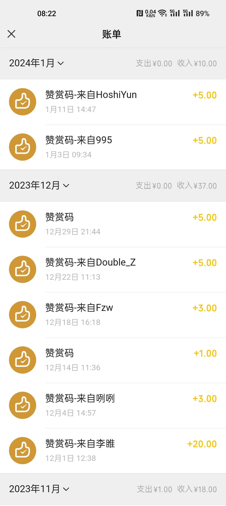

# 100万级安装量的开源作品，一年有多少打赏收入？

> 我的答案是：**330元**

## 答案

不卖关子、不吹不黑，按我个人作品2023年的打赏收入来算，打造一款100万级安装量的开源作品，一年能带来 **330元** 的收入。  

这相当于：

- 约等于或少于去建筑工地搬两天砖的收入
- 又或者加多几十块，够交个人居民医保
- 又或者略多于两个农村老人一个月能拿到的养老补贴
- 又或者…… 请自行脑补

**是不是跟你们想象的差距很大？如果不是，那我猜你大概率也是个开源作者，别问我是怎么知道的...**  

即便如此，每次收到打赏还是会很开心，这是一种被肯定的成就感，这种感觉无法用金钱来衡量。  

## 数据

先说明一下作品情况，避免大家懵逼：100万级安装量的是个啥玩意？  

简单来说，作者的作品是一款托管于Greasy Fork上的网页播放器增强脚本，几乎支持所有H5视频网站的：无极倍速调节、视频画面截图等功能。  

更详细的作品介绍请自行查阅下面的相关网址：

- 官网地址：[h5player.anzz.top](https://h5player.anzz.top)  
- GitHub地址：[github.com/xxxily/h5player](https://github.com/xxxily/h5player)  
- GreasyFork：[greasyfork.org/scripts/381682](https://greasyfork.org/scripts/381682)  

这里重点关注一下作品的相关数据：  

截至到2024年2月份作品的相关数据如下：

- GreasyFork上的总安装量已经超过了100万
- GreasyFork上的日均安装量1000+
- GitHub上的Star数2.2K+
- GreasyFork和GitHub上收到的反馈和issues也有1000+条

下面是最近三个月的打赏记录：

 
 

23年11月打赏收入：18元  
23年12月打赏收入：37元  
24年1月打赏收入：10元  

可以看出：平均每个月不足30元。  
实际统计一下2023年全年的打赏收入，具体数据如下：  

| 月份 | 打赏收入 |
| --- | --- |
| 23.01 | 42.45 |
| 23.02 | 39.67 |
| 23.03 | 48.56 |
| 23.04 | 14.42 |
| 23.05 | 0.00  |
| 23.06 | 3.00  |
| 23.07 | 4.00  |
| 23.08 | 66.11 |
| 23.09 | 30.90 |
| 23.10 | 25.88 |
| 23.11 | 18.00 |
| 23.12 | 37.00 |
| 总计  | 329.99 |

数据真实可靠，这就是一个100万级安装量的开源作品一年的打赏收入的真实例子。  

**以上，并不是想吐槽什么，更不是为了炫耀什么，只是想让更多人了解开源作者的真实一面，所以仅以我的作品的相关数据来给大家一个参考，并不能说明所有的开源作品都是如此，更不希望都是如此。**  

## 改变

优秀的开源作者并不能飞仙成神，也要吃人间烟火、养家糊口、也会面临生活的困顿局促，作者也不可能例外。  

因此作者也开始尝试探索开源作品的其它变现方式，比如：

在不影响用户体验的前提下，以文本的形式加入少量的、不影响用户体验的产品或项目推广链接。  

 
 

又例如：基于当前脚本的用户基数，推广其它优秀开源作者的作品，在帮助别人的同时，也可以此来获取一些收益。  

其它形式：说实在的，对于开源作品来说，变现极其困难，至少作者目前了解到的是这样。  

## 阻力

开源作品变现的困难之处在于：一旦开源作者尝试开始变现，就会遭到一些习惯白嫖的人的各种指责，莫名奇妙的差评或恶意举报也会逐渐多起来，这是很多不善言辞、缺乏交际的开源作者所难以面对的局面。

显然这不只是开源作品才会遇到的问题，任何一个尝试变现的项目或作品，例如公众号、视频号、直播等，都会遭遇类似的问题。一旦加上了广告或增加付费内容，用户就会开始指责你：初心被狗叼了、终于露出狼子野心、镰刀举起来了、韭菜要开割了。**更有甚者，搞得好像他们比开源作者更懂开源精神、更懂用户体验、更能深入实践社会道德一样，而曾经乐于分享、喜欢帮助他人的你，却成了丧失开源精神、败坏社会风气的罪魁祸首。**

 
 

这样做**也不全是坏事**，至少经过一段时间的沉淀，**它会过滤掉一些离谱的用户，留下一些能理解你，和确实有使用需求的用户，这样的用户会更乐于为你的作品提出有效的问题反馈，或是更有建设性的意见和建议。**  

## 劝告

2023年是AI大模型元年，也是AI智能突飞涌现的一年。2024年AI界更是开年便平地惊雷，**[Sora](https://mp.weixin.qq.com/s/rYCzpZAZDWuf4fLRXi6bdQ)**、**[Gemini 1.5](https://36kr.com/p/2650854374260993)**、**[Stable Diffusion 3](https://mp.weixin.qq.com/s/PU_VCbFU29rkfgoIm2as0g)**、**[EMO](https://mp.weixin.qq.com/s/4KGYu-B4Te5FvPfDI804mg)** 等一系列的重磅AI闪耀登场。  

与此同时，国内的就业环境却在不断劣化，越来越多的企业开启了战略性的 **开猿节流、降本增笑** “计划”。 **降薪、裁员** 的事情越发频繁，企业关门、工厂倒闭、老板跑路、旺铺转租、楼盘降价甩卖等事情已经开始屡见不鲜。在这样的大环境下，越来越多的人开始寻求转行谋生，或者想尽办法开辟副业渠道，以备不时之需。

互联网从业人员，**在AI能力的加持下，** 个人能力得到了极大的提升，结合得好、运用得当，**甚至可以做到一人单挑整个团队** 的效果。因此越来越多的程序员开始跃跃欲试，尝试做**独立开发**，开发一些小工具、小插件、小脚本，或者是运营自己的小程序、公众号，视频号等，以此来挣点外快，发展个人事业。  

一定程度上来说：**热衷于造轮子、搞开源的程序员才是好程序员。** 也是优秀程序员开辟副业渠道、成为独立开发、发展个人事业的常见选项之一。在AI的辅助加持下，走这条路的程序员也愈发地多了起来。这其中有希望通过开源项目磨练技术的，也不乏寄望通过开源项目变现，实现逆袭的，或者是奔着增加应聘优势、获得涨薪筹码而来的。但是，不管你是出于什么目的，在目前这个试错成本偏高的恶化环境下，我劝你：**千万不要寄望通过打赏/捐赠来激发你的开发热情，或打算以此来维持生计！尽早打消这个念头，以我过来人的经历告诉你：开源作者靠打赏/捐赠挣钱的话，基本等于自寻死路，它会浇灭你所有的热情。**

很多不明就里的人，看到优秀的开源作品，第一反应肯定是：作者 **NB.gif**，**你他娘的还真是个天才.jpg**！但接下来的反应可能就是：作者肯定通过这个作品赚了不少钱吧，肯定不缺我这一点打赏/捐赠。又或者是：别人都不一定出钱，就我出，我是不是傻？ 这是普遍的心理预期。即使没有这个心理预期，人们也更愿意为有明确收费要求的产品或服务付费，而不是为本身就是免费的开源作品打赏/捐赠，这或许也是 “**心理账户（Mental accounting）理论**” 的一种体现吧。  
